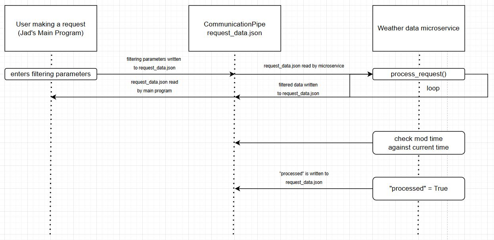

# cs361-assignment8
Communication Contract:

How to request data from microservice:
1. Write to the request_data.json file the filtering parameters.
2. Then dump the filtering data to the file.
3. For example: with open('request_data.json', 'w') as f:
                    json.dump(request, f)

How to receive data from microservice:
1. Once the microservice is completed, read from the same response_data.json file.
2. For example: with open('request_data.json', 'r') as f:
                    json.dump(request, f, indent=2)

